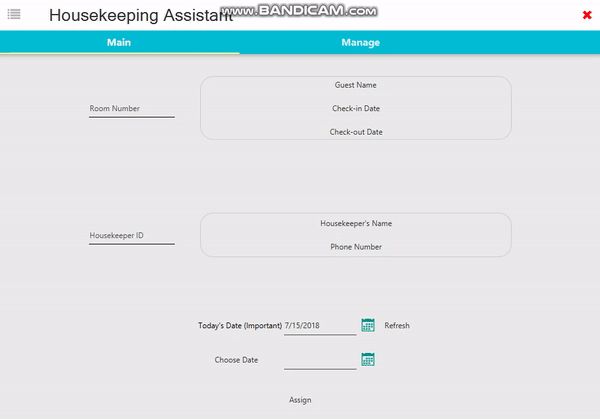
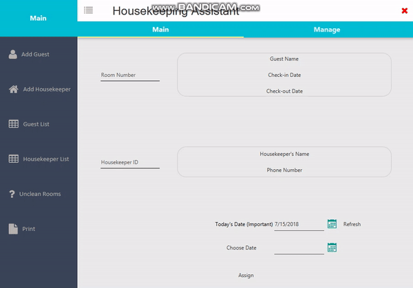
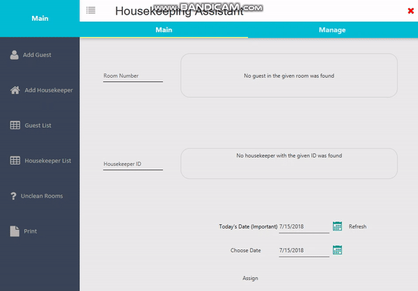

# Housekeeping Assistant
The project was chosen to be made for GTLC (Grand Teton Lodge Company) Housekeeping Department, since the previous software had bugs and the UI was outdated.

The software lets the user manage housekeepers and guests, make assignments and view/print reports. Number of libraries were used.

I started off following a JavaFX tutorial series on Library Management System Software from Youtube - [Genuine Coder Youtube Channel](https://www.youtube.com/playlist?list=PLhs1urmduZ29jTcE1ca8Z6bZNvH_39ayL), among many others. Thus, the software design pattern, and the libraries used are similar.

Through this project, I have gained experience in JavaFX, Software Design, GUI Development, SQL Database, Debugging etc.

---
### Libraries Used
  * [JFoenix](https://github.com/jfoenixadmin/JFoenix) - JavaFX Design Library
  * [Apache Derby](https://db.apache.org/derby/) - Standalone Relational database
  * [High Quality UI Controls](http://fxexperience.com/controlsfx/) - UI Control Library
  * [FontawesomeFX](https://bitbucket.org/Jerady/fontawesomefx) - Icon library
  * [Jasper Reports](https://community.jaspersoft.com/project/jasperreports-library/releases) - PDF Export
 ---
### Features
##### Main Window

##### Manage Tab

##### Print Section

